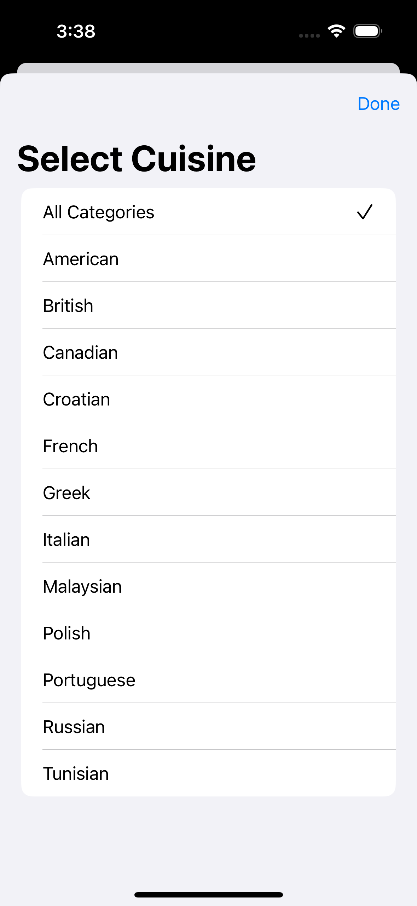
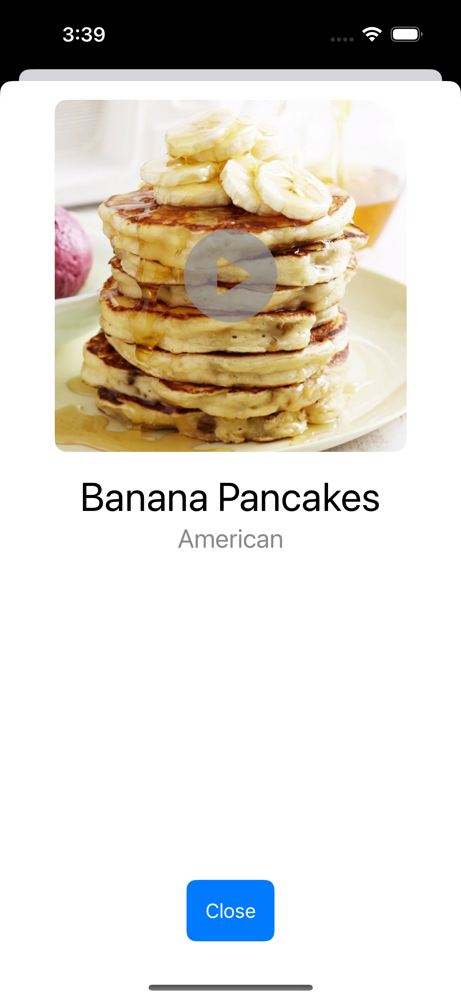

# RecipeApp

RecipeApp is an iOS app built with SwiftUI that displays recipes fetched from a remote JSON endpoint. The app is designed with a clean MVVM architecture and provides users with a seamless experience in browsing recipes. It features efficient image caching to reduce network usage and robust error handling.

## Features

- **Display Recipe Information**: Shows recipe name, photo, and cuisine type. 
- **Image Caching**: Caches recipe images to disk to minimize unnecessary network usage and improve app performance.
- **Manual Refresh**: Allows users to refresh the recipe list anytime to load the latest data.
- **Error Handling**: Displays appropriate error messages if the data fails to load or if the recipe list is empty.

## Focus Areas

The primary focus of the project was:
- **Efficient Network Usage**: Caching images to disk reduces redundant network calls, especially for images that have already been loaded.
- **User Experience**: Clean and responsive design with SwiftUI. The app also features manual refresh functionality for the recipe list.
- **Testing**: Implemented unit tests to validate various scenarios, including malformed data, empty recipe lists, and missing required fields.

## Time Spent

Approximately **4-5 hours** were spent on this project. The time was allocated as follows:
- **2 hours** for building the app's UI and integrating with the API.
- **2 hours** for implementing image caching, manual refresh, and error handling.
- **1 hour** for writing unit tests to ensure robust data handling.

## Trade-offs and Decisions

- I decided to implement a custom image caching solution using `URLCache` to avoid reliance on HTTP caching. This gives more control over the caching process and improves performance by reducing redundant network requests for images.
- I prioritized testing edge cases like malformed and empty data, though integration and UI tests were not included as per the project guidelines.

## Weakest Part of the Project

The weakest part of the project could be the lack of integration tests. While unit tests cover data handling and error scenarios, testing interactions with the UI could improve confidence in the app's functionality.

## External Code and Dependencies

- **No external dependencies** were used for this project. All features, including image caching, error handling, and networking, were implemented using native iOS frameworks like `URLSession`, `UIImageView`, and `SwiftUI`.

## Additional Information

- The app ensures no recipes are loaded unintentionally and only fetches data when the user launches the app or manually refreshes the list.
- The image caching solution ensures images are cached on disk, which helps reduce network usage when images are displayed multiple times.

## Steps to Run the App

1. Clone this repository to your local machine.
2. Open `RecipeApp.xcodeproj` in Xcode.
3. Build and run the project in the iOS Simulator or on a physical device.
4. The app will automatically fetch and display recipes from the remote JSON API endpoint.
5. Pull to refresh the recipe list for the latest data.

### API Endpoints

The app fetches recipes from the following endpoints:
- **All Recipes**: [https://d3jbb8n5wk0qxi.cloudfront.net/recipes.json](https://d3jbb8n5wk0qxi.cloudfront.net/recipes.json)
- **Malformed Data**: [https://d3jbb8n5wk0qxi.cloudfront.net/recipes-malformed.json](https://d3jbb8n5wk0qxi.cloudfront.net/recipes-malformed.json)
- **Empty Data**: [https://d3jbb8n5wk0qxi.cloudfront.net/recipes-empty.json](https://d3jbb8n5wk0qxi.cloudfront.net/recipes-empty.json)

## Sample Recipe Images

